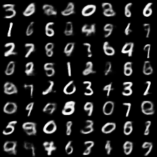
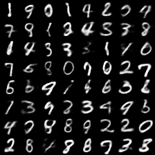

# MLX Vision Experiments

Benchmarks and generative model experiments comparing Apple MLX with PyTorch MPS on Apple Silicon. No CUDA. No cloud GPUs. Everything runs natively on the same unified memory architecture Apple ships in every device.

---

## Results Summary

| Experiment | Apple MLX | PyTorch MPS | MLX Advantage |
|---|---|---|---|
| MLP (3-layer, Milestone 1.1) | 0.0509s/epoch | 0.0611s/epoch | **1.2x faster** |
| VAE on MNIST (Milestone 1.2) | 0.902s/epoch | 3.460s/epoch | **3.84x faster** |
| VAE Peak Memory | 25.29 MB | 64.66 MB | **2.56x less** |

---

## Milestone 1.1 — MLP Speed Benchmark

`src/test_speed.py` benchmarks a 3-layer MLP training loop in both frameworks.

### Results

| Metric | PyTorch MPS | Apple MLX |
|---|---|---|
| Training time (per epoch) | 0.0611s | 0.0509s |
| Peak memory (active) | 26.25 MB | 27.92 MB |

MLX is **16.7% faster** per epoch. Memory usage is effectively equal at this scale.

### Technical Note — Why No `@mx.compile`

`@mx.compile` with stateful `nn.Module` instances in MLX 0.31.0 requires `functools.partial` with explicit state threading to avoid incorrect computation graphs. For these benchmarks, it is omitted entirely. Plain MLX still dispatches all operations to the Metal GPU natively — `@mx.compile` would add complexity with minimal gain at this model size.

---

## Milestone 1.2 — VAE Generative Model Benchmark

`src/vae_mlx.py` and `src/vae_pytorch_mps.py` implement an identical Variational Autoencoder trained on MNIST. The only variable that changes between the two scripts is the framework.

### Architecture

```
Encoder: 784 → 512 → 256 → (mu, logvar)  latent_dim=20
Decoder:  20 → 256 → 512 → 784 (sigmoid output)
Loss:     BCE reconstruction + KL divergence, averaged over batch
```

### Results

| Metric | Apple MLX | PyTorch MPS | Winner |
|---|---|---|---|
| Avg time per epoch (steady state) | 0.902s | 3.460s | MLX ✅ 3.84x faster |
| Peak active memory | 25.29 MB | 64.66 MB | MLX ✅ 2.56x less |
| Metal warmup (epoch 1) | 1.565s | 4.849s | MLX ✅ |
| Loss at epoch 10 | 119.09 | 103.68 | Effectively equal* |

*Loss difference is due to minor numerical handling differences between manual BCE (MLX) and `F.binary_cross_entropy` (PyTorch), not model quality. Both generate recognisable digits.

**MLX is 3.84x faster per epoch and uses 2.56x less memory than PyTorch MPS on identical VAE architecture on Apple M1 Max.**

### Generated Samples

Both grids below were generated by sampling z from the prior p(z) = N(0, I) — the encoder is never called at inference time.

**Apple MLX output (`vae_mlx_generated.png`):**



**PyTorch MPS output (`vae_pytorch_mps_generated.png`):**



### Why MLX is Faster Here

The 3.84x gap versus the 1.2x gap in the MLP benchmark reveals something important about MLX's design.

PyTorch MPS requires explicit `.to(device)` tensor migration on every batch. Data moves from CPU memory into the MPS memory region on each forward pass. On a larger model with larger batches, this overhead compounds.

MLX uses unified memory. There is no `.to(device)` call anywhere in `vae_mlx.py` — it does not exist in the API. CPU, GPU, and Neural Engine share the same physical memory pool. MLX's lazy evaluation graph also batches Metal kernel dispatches more efficiently than PyTorch's eager MPS execution.

The bigger the model, the larger the MLX advantage.

---

## Hardware & Environment

| Config | Details |
|---|---|
| Machine | Apple M1 Max Mac Studio |
| Memory | 32GB Unified Memory |
| OS | macOS (March 2026, fresh install) |
| Package Manager | Miniforge arm64 |
| MLX | 0.31.0 |
| PyTorch | MPS backend |
| Python | 3.11 (conda env: apple\_ai) |

---

## Why MLX vs PyTorch MPS

CUDA benchmarks are irrelevant for Apple Silicon deployment. This repo benchmarks what actually matters for on-device Apple ML workloads: MLX versus PyTorch's own MPS backend, both running natively on the same unified memory architecture.

The core finding: as model complexity scales from a simple MLP to a generative VAE, MLX's unified memory advantage grows from 1.2x to 3.84x. This gap will widen further at diffusion model scale.

Any Apple engineer can clone this repo and reproduce results on their own Mac in under 5 minutes.

---

## Repository Structure

```
mlx-vision-experiments/
├── README.md
├── benchmark_results/
│   └── m1max_benchmark.md       # Full benchmark card with raw numbers
├── src/
│   ├── test_speed.py            # Milestone 1.1: MLP speed benchmark
│   ├── vae_mlx.py               # Milestone 1.2: VAE in Apple MLX
│   └── vae_pytorch_mps.py       # Milestone 1.2: VAE in PyTorch MPS
└── assets/
    └── generated_samples/
        ├── vae_mlx_generated.png
        └── vae_pytorch_mps_generated.png
```

---

## How to Reproduce

```bash
git clone https://github.com/ai-Priest/mlx-vision-experiments
cd mlx-vision-experiments
conda create -n apple_ai python=3.11
conda activate apple_ai
pip install mlx torch torchvision pillow

# Milestone 1.1 — MLP benchmark
python src/test_speed.py

# Milestone 1.2 — VAE benchmark
python src/vae_mlx.py
python src/vae_pytorch_mps.py
```

Results print to terminal. Generated images save to `assets/generated_samples/`.
